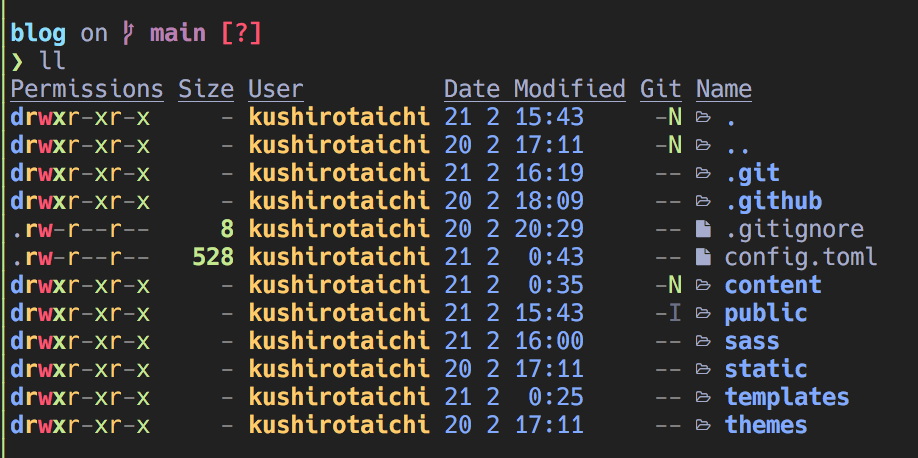

+++
title = "AlacrittyでMaterial Theme Darkerを設定する"
date = "2021-02-21"
template = "post/post.html"
+++

# はじめに
Neovimのcolor schemeに以下のschemeを用いている。
[kaicataldo/material.vim: 🎨 A port of the Material color scheme for Vim/Neovim](https://github.com/kaicataldo/material.vim)

Alacrittyターミナルの色設定もmaterialに対応させようとしたところ、思ったような設定ファイルが見つからなかったので自分で設定ファイルを作った。
<!-- more -->

# 設定ファイル
以下の設定ファイルで、Neovimのschemeと同じ色合いにすることができた。

{{ gist(url="https://gist.github.com/neppyaga/87472bb671f9aa9111b1b3f8b5f1b2dc") }}

実際の画面は以下のような感じ。実はこのブログも`material theme darker`と同じ色合いで実装している。

現状は最低限の設定を行ってみた状態。

他にも色に関する設定値はありそうなので、随時gistを更新するかも。

# おわりに
参考リンクは以下の通り。
- [Material Theme](https://material-theme.site/)
- [alacritty/alacritty.yml at master · alacritty/alacritty](https://github.com/alacritty/alacritty/blob/master/alacritty.yml)
